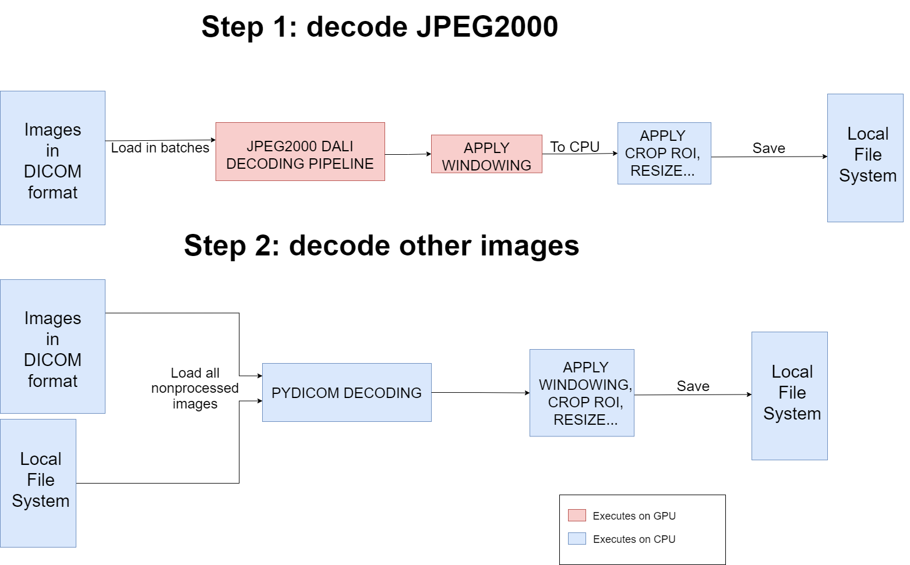

# Mammography Breast Cancer Recognition using Deep Learning and Convolutional Neural Nets
## 1.    Introduction
The goal of this project is to identify breast cancer from screening mammograms from regular screening. Because of medical nature of the problem, some medical terms will firstly be defined, so that regular reader can familiarize with the topic.  
Mammography is the imaging modality of choice for breast cancer screening in women. It also plays an important role in the evaluation of other breast diseases in all patients. In essence, mammography as an X-ray for the breast. 
A screening mammogram is the most common type of mammogram performed. During a screening exam the mammogram technologist will perform two standard views: craniocaudal (CC) and mediolateral oblique (MLO). During mammography, the breast is put into compression, which can be quite uncomfortable for the patient! For the CC view, the breast is compressed from "head to toe" while for the MLO view, the breast is compressed "side to side" at an angle. This allows radiologists to localize a finding to a particular area in the breast and to determine what type of abnormality is present. 
The Breast Imaging Reporting and Data System (BI-RADS) is a standard lexicon used by radiologists that allows for improved peer review and quality assurance mechanisms with the goal of improving patient care. 
There are 7 main BI-RADS scores, or categories:
* 0 - Need additional imaging evaluation
* 1 - Negative
* 2 - Benign
* 3 - Probably Benign
* 4 - Suspicious
* 5 - Highly Suggestive of Malignancy
* 6 - Known Biopsy-Proven Malignancy
 
<!-- End list -->
Screening mammograms can only be assigned a BI-RADS score of 0, 1, or 2, meaning that cancer can’t be diagnosed just from mammogram. If radiologist noticed something suspicious, patient will undergo further procedure. For this problem, one can essentially think of 0 as "abnormal" and 1 and 2 as "normal".
 
The solution should help doctors with diagnosing suspicious early stage breast cancer. The early stage cancer is very hard to see, and on many examples radiologist can not be sure what is on image. That is where this classifier should step up, to confirm or dispute those border cases, and make decisions less error prone.

## 2.    Data
Data is 54000 images in DICOM format. *Digital Imaging and Communications in Medicine* (DICOM) is the standard for the communication and management of medical imaging information and related data. It also contains many other information alongside pixels that represent image, such as patient id, image pixel representation etc.  Pixel data can be compressed using variety of standards, most commonly JPEG, lossles JPEG and JPEG2000. Beside image data, there is csv with tabular information.  
For detailed insight into data analysis, check the notebook „rsna-exploratory-data-analysis.ipynb“.

## 3.   Preproessing
Processing of DICOM images is very demanding task, especially if the time in which processing must be finished is somehow limited. The image resolution is very high (eg. 5000x4000), and each pixel is represented with 16 bits, instead of conventional 8 bit representation. The decoding of images (lossless JPEG or JPEG2000) takes lot of processing time as well.  
Images contain region of interest (breast of a patient) and black background that is useless. So, cropping the ROI should also be one of the processing steps. ROI is, luckily, very easily detected for X-Ray images, because all pixels that are no tissue will be totally black.  
All images should be resized to smaller resolution (for example, 512x512 or 768x768), because most of Convolutional Neural Nets can’t deal with very high resolution, and it is computationally very demanding. After detecting and cropping ROI, image is resized to desired resolution. When doing transformation in this order, most information is preserved.  
Since most DICOM files have ranges greater than 0-255 (8 bit), applying standard normalization techniques results in loss of information. Since there is no way around this loss, the best we can do is to pick the "most valuable" range of pixels to normalize. This is what "windowing" is, and it's critical to human readers being able to interpret images, but also will improve model behaviour. Information about 'window' of pixel values is accesable in DICOM information.  
Nvidia DALI (Data Loading Library) is a library for data loading and pre-processing to accelerate deep learning applications, and it is used for accelerating decoding of JPEG2000 images (about 50% of data). Processing JPEG2000 images this way (using single GPU), improves speed aproximately 20 times.

Custom preprocessor class is made to make all of the above functionality easily used. Example datasets that are made using this class can be found on links:
-	https://www.kaggle.com/datasets/nikolagavranovic/rsna-mamography-cancer-recognition-768x768
-	https://www.kaggle.com/datasets/nikolagavranovic/rsnamamorgaphybreastcancerrecognition512x512
For functionality demonstration, check the notebook 'image-preprocessing-demo.ipynb'
<!-- End list -->
## 4.    Training

The dataset imbalance is great, with less than 2% of data belonging to the positive class. That makes it very tough for training any neural net. To tackle this issue, two methods are combined:
*   Weighted loss function – custom binary cross entropy class weighted function is used for loss function. Positive weight is 3 – 20, depending on weather upsampling is used or not.

<!-- End list -->

$
L=  {1\over N} \sum_{i=1}^N((w_{positive} y_{true}  log⁡(y_{pred} )-(1- y_{true}) w_{negative}  log⁡(1- y_{pred}))$

*   Upsampling – technique that samples more frequently images of minority class.
 <!-- End list -->

For imbalanced binary classification problems, metric choice is very significant. Accuracy is irrelevant (if all samples are classified as negative, that would be >98% accuracy), so the F metric is chosen, with it’s general form:  
$F_β={(1+β^2)(precision*recall)\over(β^2 precision+recall)}$
  
 With beta parameter can be tuned which was more important, precision or recall. This parameter should be determined with doctors, because false negatives are very dangerous, and can result in not discovering the cancer, but false positives also have consequences (eg. Patient must undergo biopsy). In training process, beta parameter is 1, and treats both recall and precision as they are of same importance. 
Training is firstly done on simple models, (ResNet18) and small image dataset (256x256). Plan was to gradually use more complex models, and higher image resolution. After ResNet18, it is experimented on ResNet50 and ResNext50. All of these experiments can be found in experiments folder.  
Using other information from CSV, such as age and implant data, did not improve any score, so it is decided not to use them at all.  
ResNet (or ResNext) architecture worked quite well, but have one big issue: input resolution. First layer of these architectures resize image to input size 224x224, which might be too small resolution for this type of problem. As a natural choice, EfficientNets are chosen to perform further experiments, since they are not just scaled-in-depth, but also in width.  

## 5.    Results

ResNext50 trained for 8 epochs on 85% training data and validated on 15% of data with upsampling and 512x512 resolution, with custom preprocessed data, achieved F1 score = 0.3 on hidden dataset that consist of 32000 images.  
Further experiments will involve K-Fold cross validation, and experimenting with EffitientNets. Also, because images are labeled on laterality level, there is possibility of some image label positive but not containing visible cancer. So some kind of multi instance learning will be tried.
